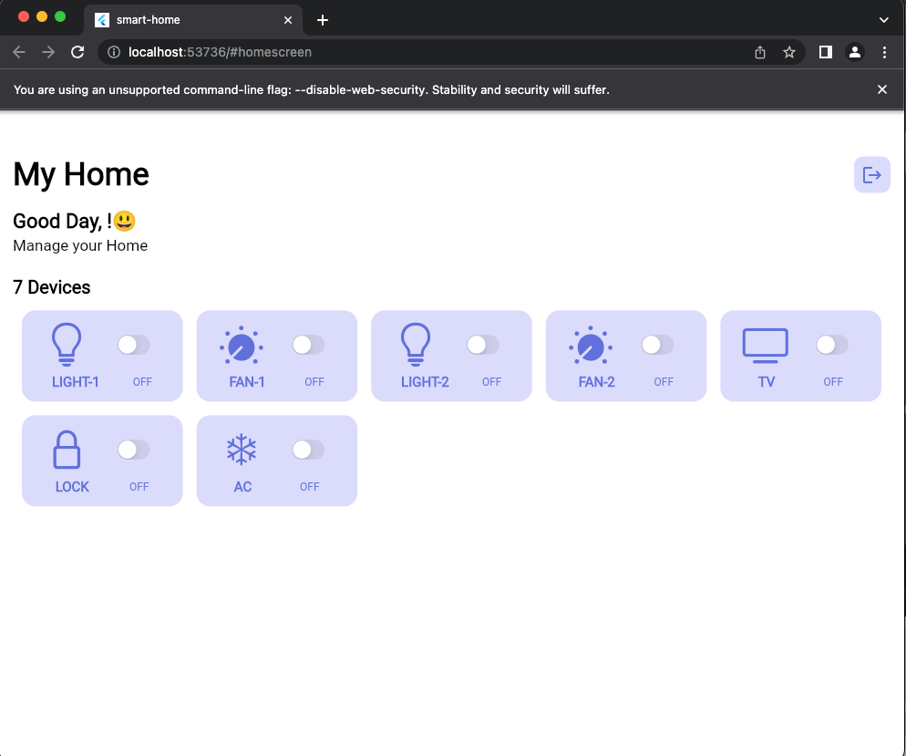

# SmartHome

A new Smart-Home Flutter project.

## Getting Started

flutter create --org com.<orgName> <AppName>

Open Firebase : https://console.firebase.google.com/

- Create Project <name>
- Under Project select Flutter 
- Follow the Instructions
- Enable Authentication

## Finally

